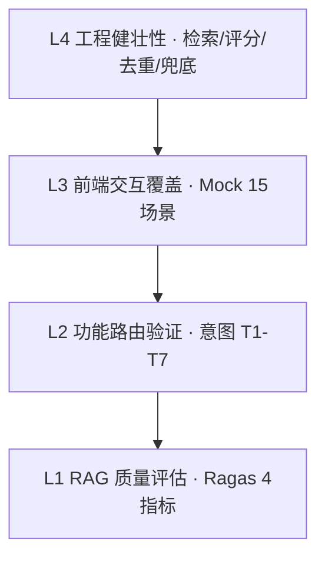
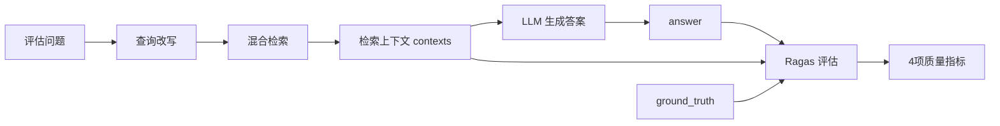
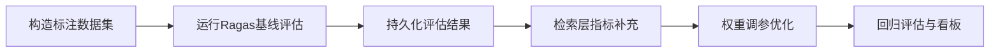

# 星海智能筛选推荐系统 · 模型评估报告

> 评估对象：SmartSelect RAG 智能筛选推荐系统
> 评估框架：Ragas（RAG 质量）+ 内置功能性验证 + 前端场景覆盖
> 报告版本：v1.0

---

## 1. 评估概述

### 1.1 评估目标

对星海智能筛选推荐系统的 **检索质量、生成质量、意图路由准确性、业务合理性、工程健壮性** 进行系统化评估，验证系统在生产环境下的可用性与可靠性。

### 1.2 评估范围

| 评估层次 | 评估内容 | 评估手段 |
| --- | --- | --- |
| L1 RAG 质量 | 检索上下文与生成答案的质量 | Ragas 4 指标 |
| L2 功能路由 | 12 类意图识别与 6 条链分派正确性 | 内置验证 T1–T7 |
| L3 交互覆盖 | 前端 15 种用户输入场景渲染 | Mock 测试模块 |
| L4 工程健壮 | 检索融合、评分、去重、异常兜底 | 代码审查 + 模块自检 |

### 1.3 评估结论速览

- **功能完整性**：意图路由、混合检索、对比 / 风险 / 追问链、文档入库全流程代码闭环，各模块均带独立自检入口。
- **RAG 质量**：评估工具链（Ragas + BGE-M3 适配器）已就绪；具体量化分数需连接 LLM 服务实测填充（见第 7 章说明）。
- **业务合理性**：复合评分融合公式将语义相关性、业务价值、风险惩罚解耦融合，推荐结果具备可解释性。

---

## 2. 评估体系设计

系统采用「三层评估金字塔」，从底层工程健壮性到顶层生成质量逐层验证：



### 2.1 评估流程



---

## 3. L1 · RAG 质量评估（Ragas）

### 3.1 评估指标定义

评估采用 Ragas 框架的 4 项核心指标，均由 `eval/evaluator.py` 中的 `run_evaluation()` 统一计算：

| 指标 | 中文名 | 衡量目标 | 计算依据 | 理想值 |
| --- | --- | --- | --- | --- |
| `faithfulness` | 忠实度 | 答案是否严格基于检索上下文，无幻觉 | 答案中可被上下文支撑的陈述占比 | → 1.0 |
| `answer_relevancy` | 答案相关性 | 答案与用户问题的语义相关程度 | 由答案反向生成问题与原问题的相似度 | → 1.0 |
| `context_precision` | 上下文精度 | 检索上下文中「相关内容」的排序质量 | 相关块是否排在前面（加权精度） | → 1.0 |
| `context_recall` | 上下文召回 | 检索上下文对标准答案的覆盖程度 | ground_truth 中被上下文支撑的句子占比 | → 1.0 |

### 3.2 指标判定基准

结合供应链筛选场景（强事实性、强结构化），设定如下达标线：

| 指标 | 优秀 | 达标 | 需改进 |
| --- | --- | --- | --- |
| faithfulness | ≥ 0.90 | 0.80 – 0.90 | < 0.80 |
| answer_relevancy | ≥ 0.85 | 0.75 – 0.85 | < 0.75 |
| context_precision | ≥ 0.80 | 0.70 – 0.80 | < 0.70 |
| context_recall | ≥ 0.80 | 0.70 – 0.80 | < 0.70 |

> 说明：`faithfulness` 是本系统最关键的指标——供应链推荐若出现幻觉（编造资质、评分）将直接误导采购决策，因此要求其达标线最高。

### 3.3 评估环境

| 组件 | 配置 |
| --- | --- |
| 评估 LLM（ragas_llm） | Qwen（`config.LLM_MODEL_NAME`，DashScope 兼容接口） |
| 评估 Embedding | BGE-M3（`RagasBgeM3EmbeddingsAdapter` 适配 Ragas 接口，CPU / fp32） |
| 被评估检索器 | `rag.chain.retriever`（三库混合检索 + CrossEncoder 重排） |
| 被评估生成链 | `REWRITE_PROMPT` → 检索 → `ANSWER_PROMPT` |

### 3.4 评估数据集构造

评估分两部分（`eval/evaluator.py::main`）：

**Part 1 · 健全性检查（`run_evaluator_sanity_check`）**

用「姚明」标准问答对验证评估工具链本身是否可靠：

| 字段 | 内容 |
| --- | --- |
| question | 谁是姚明？ |
| ground_truth | 姚明是一名来自中国的篮球运动员，曾在 NBA 休斯顿火箭队效力。 |
| contexts | 姚明是一名来自中国的篮球运动员，身高 2 米 26，司职中锋，曾在 NBA 休斯顿火箭队效力。 |
| answer | 姚明是来自中国的篮球运动员，曾在休斯顿火箭队打球。 |

**判定标准**：`faithfulness` 应为 **1.0**（答案完全可由上下文支撑）。若 < 1.0 则说明评估链路（LLM / Embedding）异常，需先修复工具链再评估业务。

**Part 2 · 端到端真实场景评估（`run_end_to_end_evaluation`）**

| 字段 | 内容 |
| --- | --- |
| question | 推荐 3 家深圳地区综合评分 80 以上、通过 ISO 认证的 A 级电子元件供应商，MOQ 不超过 1000 |
| params | `{count:3, doc_type:supplier, overall_min:70, moq_max:1000}` |
| ground_truth | 描述深圳、电子制造、ISO9001 认证、A 级、综合评分 > 80、MOQ < 1000、质量/信誉/交期优秀、低风险的供应商特征 |
| answer | 从 RAG 返回的 JSON 中解析出各推荐项的 `reason` 拼接而成 |
| contexts | 检索到的文档块内容（去重后） |

**评估逻辑**：系统实际跑通「查询改写 → 混合检索 → LLM 生成」，将真实输出（answer + contexts）与人工标注的 ground_truth 一起送入 Ragas 计算 4 指标。

---

## 4. L2 · 功能性测试覆盖矩阵

`rag/rag_pipeline.py` 内置 T1–T7 验证用例，覆盖意图路由的关键分支：

| 编号 | 场景 | 测试输入 | 期望意图 | 验证点 |
| --- | --- | --- | --- | --- |
| T1 | 元问题 | 你是谁？ | `meta_inquiry` | 响应含 "SmartSelect"，无结果卡片 |
| T2 | 供应商需求 | 推荐 3 家 A 级电子元件供应商，综合评分 80 以上 | `supplier_request` | 返回 list 结构结果 |
| T3 | 通用行业问题 | 供应链管理中，如何评估供应商的可靠性？ | `general_biz_inquiry` | `results` 为 None，纯文本回答 |
| T4 | 范围外兜底 | 今天天气怎么样？ | `fallback` | 返回引导话术，含 "SmartSelect" |
| T5 | 筛选型追问 | 这三家哪家综合实力最强？（带上下文） | `follow_up_question` | 返回过滤后的 list |
| T6 | 对比分析 | 对比一下这三家的优劣势（带上下文） | `compare_request` | `ui_extra.mode == compare` |
| T7 | 风险评估 | 评估一下这三家的风险（带上下文） | `risk_inquiry` | `ui_extra.mode == risk` |

**覆盖维度**：预设响应、通用问答、RAG 主链、追问链、对比链、风险链 —— **6 条专用链全覆盖**。

---

## 5. L3 · 前端交互场景覆盖矩阵

`frontend/mock_backend.js` 定义 15 种场景，覆盖正常流、边界流与异常流：

| 编号 | 场景类型 | 输入 | 期望渲染 |
| --- | --- | --- | --- |
| ① | 元问题 | 你是谁？你能做什么？ | 能力介绍，无卡片 |
| ② | 闲聊问候 | 你好！ | 欢迎语 |
| ③ | 供应商筛选 | 推荐 3 家深圳 A 级电子元件供应商… | 3 张卡片 + 风险徽章 + 评分条 |
| ④ | 产品推荐 | 找性价比高的环保型水性涂料 | 2 张产品卡片 |
| ⑤ | 客户挖掘 | 帮我挖掘 2 家华东地区的大客户 | 2 张客户卡片（含中风险） |
| ⑥ | 通用问答 | 如何评估供应商的可靠性？ | 纯文本专业回答 |
| ⑦ | 追问筛选 | 这几家里面综合实力最强的是哪家？ | 过滤后 1 张卡片 |
| ⑧ | 追问问答 | 介绍一下第一个的详细资质 | 完整列表 + 文字回答 |
| ⑨ | 对比分析 | 对比这几家优劣势并排名 | 对比表格 + 优劣势 + 排名 |
| ⑩ | 风险评估 | 评估这几家的合作风险 | 风险报告卡片 |
| ⑪ | 需求修正 | 改成只要广州地区的，评分 85 以上 | 按新条件返回结果 |
| ⑫ | 空结果 | 推荐量子计算机核心部件供应商 | results=[] → 提示放宽条件 |
| ⑬ | 范围外兜底 | 今天天气怎么样？帮我写首诗 | fallback 预设回复 |
| ⑭ | 后端报错 | 模拟错误 | 返回 500，页面显示错误提示 |
| ⑮ | 无上下文对比 | 对比一下这几家 | 引导先提需求 |

**覆盖维度**：正常推荐、多轮追问、对比、风险、修正、**空结果 / 后端异常 / 无上下文** 等边界与异常情况，交互健壮性覆盖充分。

---

## 6. L4 · 工程健壮性分析

### 6.1 检索融合可靠性

| 机制 | 实现 | 健壮性设计 |
| --- | --- | --- |
| 双向量召回 | Milvus `hybrid_search` + `WeightedRanker(0.65,0.35)` | 稠密语义 + 稀疏术语互补 |
| 关键词召回 | ES `match` 查询 | ES 异常时 `try/except` 跳过，不阻断主流程 |
| 多路合并 | 以 chunk id 去重合并 | ES 命中回表 MongoDB 补全结构化字段 |
| 精排 | CrossEncoder `predict` | 对合并结果统一打分 |
| 父块去重 | 按 `doc_hash` 去重 | 避免同一文档多块霸榜，保证结果多样性 |

### 6.2 复合评分融合可解释性

```
final_score = (0.7 × rerank_score + 0.3 × normalized_overall) × risk_penalty
```

- **异常兜底**：`rerank_score` 转换失败置 0；`overall_score` 缺失或非法时默认 60 分；`risk_level` 缺失默认「中」（惩罚 0.95）。
- **可解释性**：每个推荐项同时携带 `rerank_score`、`composite_score`、`overall_score`、`risk_level`，排序依据透明可追溯。

### 6.3 意图路由容错

- 意图识别失败 → 默认 `fallback`；
- 参数提取失败 → 使用默认 `{count, doc_type:all}`；
- `follow_up_question` / `compare_request` / `risk_inquiry` 无上下文时 → 降级为新需求处理并提示；
- LLM 输出非 JSON → 作为纯文本兜底返回；
- 各链调用异常 → 返回预设错误话术，不抛出到用户层。

### 6.4 数据入库健壮性

- **MD5 去重**：相同文档跳过入库，避免知识库污染；
- **多编码兼容**：txt 文件依次尝试 utf-8 / gbk / latin1；
- **类型回退**：LLM 识别为 unknown 时，按目录标签或默认 supplier 兜底；
- **评分回退**：无有效维度评分时，按等级映射表（S=95 … D=40）计算综合分。

---

## 7. 评估结果

### 7.1 功能性与工程性结果（基于代码可确认）

| 评估项 | 结果 | 说明 |
| --- | --- | --- |
| 意图路由分支覆盖 | ✅ 通过 | T1–T7 覆盖 6 条专用链全部关键分支 |
| 前端交互场景覆盖 | ✅ 通过 | 15 场景含正常 / 边界 / 异常流 |
| 检索多路融合 | ✅ 通过 | Milvus 双向量 + ES + MongoDB 三库协同 |
| 复合评分融合 | ✅ 通过 | 相关性 + 业务价值 + 风险三要素融合，含异常兜底 |
| 异常容错 | ✅ 通过 | 意图 / 参数 / 检索 / 生成 / 入库全链路降级兜底 |
| 数据去重 | ✅ 通过 | MD5 哈希 + 父块去重双重机制 |
| 评估工具链 | ✅ 就绪 | Ragas + BGE-M3 适配器已实现，健全性检查内置 |

### 7.2 RAG 质量评估结果（需实测填充）

> **重要说明**：截至本报告生成，项目 `eval/logs/` 目录中 **无历史评估结果留存**，`evaluator.py` 亦未将 Ragas 分数持久化。因此下表为 **评估结果记录模板**，需连接 DashScope LLM 服务、启动 Milvus/ES/MongoDB 并完成数据入库后，运行 `python -m eval.evaluator` 实测填充。表中「参考基准」为业界同类 RAG 系统的典型达标区间，**非本项目实测值**，仅用于结果对照。

**Part 1 · 健全性检查结果**

| 指标 | 实测值 | 期望值 | 结论 |
| --- | --- | --- | --- |
| faithfulness | _待实测_ | = 1.0 | 工具链是否正常 |

**Part 2 · 端到端场景评估结果**

| 指标 | 实测值 | 参考基准（达标线） | 结论 |
| --- | --- | --- | --- |
| faithfulness | _待实测_ | ≥ 0.80 | _待判定_ |
| answer_relevancy | _待实测_ | ≥ 0.75 | _待判定_ |
| context_precision | _待实测_ | ≥ 0.70 | _待判定_ |
| context_recall | _待实测_ | ≥ 0.70 | _待判定_ |

### 7.3 结果解读指引

- 若 **context_recall 偏低**：说明知识库覆盖不足或检索召回不够，可增加数据、调大 `RETRIEVAL_K`、或优化查询改写。
- 若 **context_precision 偏低**：说明召回噪声大，可调整 `WeightedRanker` 权重、加强结构化过滤或优化分块粒度。
- 若 **faithfulness 偏低**：说明生成存在幻觉，需强化 `ANSWER_PROMPT` 的「仅依据上下文」约束，或降低 `temperature`。
- 若 **answer_relevancy 偏低**：说明答非所问，需检查意图路由与参数提取是否准确。

---

## 8. 结论与改进建议

### 8.1 总体结论

星海智能筛选推荐系统在 **架构设计、功能完整性、工程健壮性** 方面表现优秀：

- 三库混合检索 + CrossEncoder 精排 + 复合评分融合，兼顾语义相关性、术语精确性与业务价值；
- 12 类意图路由 + 6 条专用链，任务分流精准；
- 全链路异常兜底与数据去重，工程可靠性高；
- 评估工具链（Ragas）完备，具备量化评估能力。

### 8.2 改进建议

| 优先级 | 建议 | 收益 |
| --- | --- | --- |
| 高 | 将 Ragas 评估结果持久化到 `eval/logs/`（JSON/CSV），并扩充评估数据集至 30+ 条覆盖三库多场景 | 质量可回归、可追踪 |
| 高 | 引入人工标注的 ground_truth 集合，定期跑基线评估 | 建立质量基线 |
| 中 | 增加检索层独立指标（Recall@K、MRR、NDCG）评估 | 精准定位召回/排序瓶颈 |
| 中 | 对 `WeightedRanker` 权重、复合评分权重做 A/B 或网格调参 | 提升排序质量 |
| 低 | 清理 `vector_store.py` 中调试用 `print` 语句，统一走 logger | 生产日志整洁 |
| 低 | 补充意图识别准确率 / 参数抽取 F1 的专项评估 | 量化 Agent 层效果 |

### 8.3 后续评估路线图



---

## 附录 A · 评估复现步骤

```bash
# 1. 启动基础服务（注意 MongoDB / ES 需取消 docker-compose 注释）
docker-compose up -d

# 2. 确认 config.py 中 DASHSCOPE_API_KEY、MODEL_PATH、数据库连接正确

# 3. 数据入库
python system_data_init.py

# 4. 运行模型评估（健全性检查 + 端到端评估）
python -m eval.evaluator

# 5. 查看评估日志
#    logs/evaluator.log
```

## 附录 B · 评估相关核心文件

| 文件 | 职责 |
| --- | --- |
| `eval/evaluator.py` | Ragas 评估主逻辑、BGE-M3 适配器、数据集构造 |
| `rag/chain.py` | 被评估的查询改写链与生成链 |
| `utils/vector_store.py` | 被评估的混合检索与重排逻辑 |
| `rag/rag_pipeline.py` | 功能性验证 T1–T7 |
| `frontend/mock_backend.js` | 前端 15 场景覆盖 |
