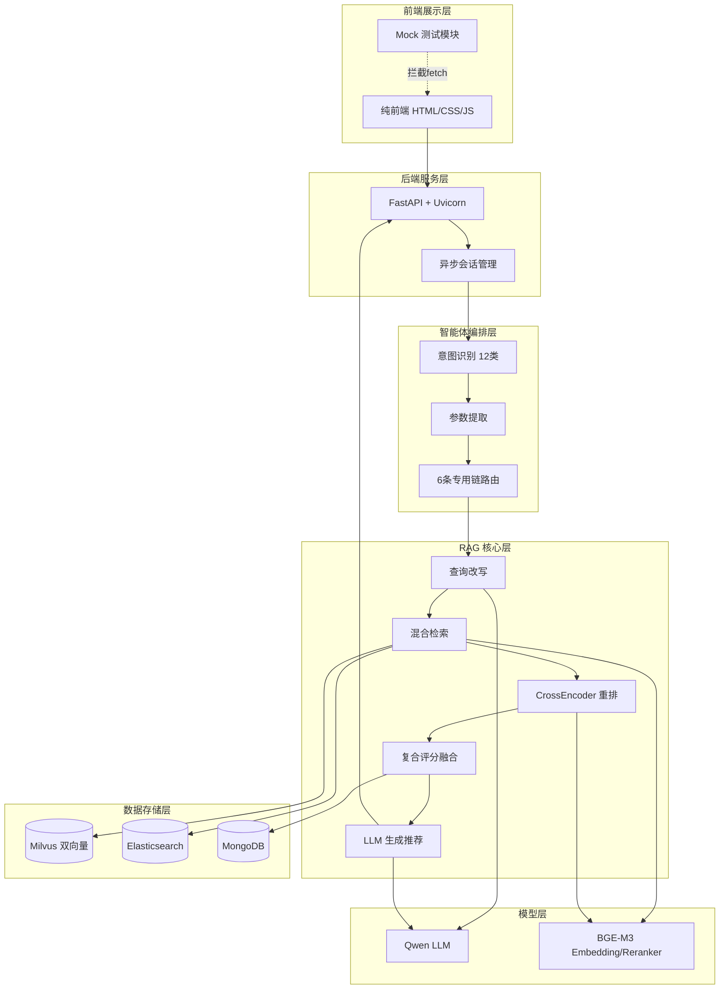
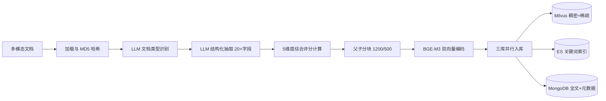
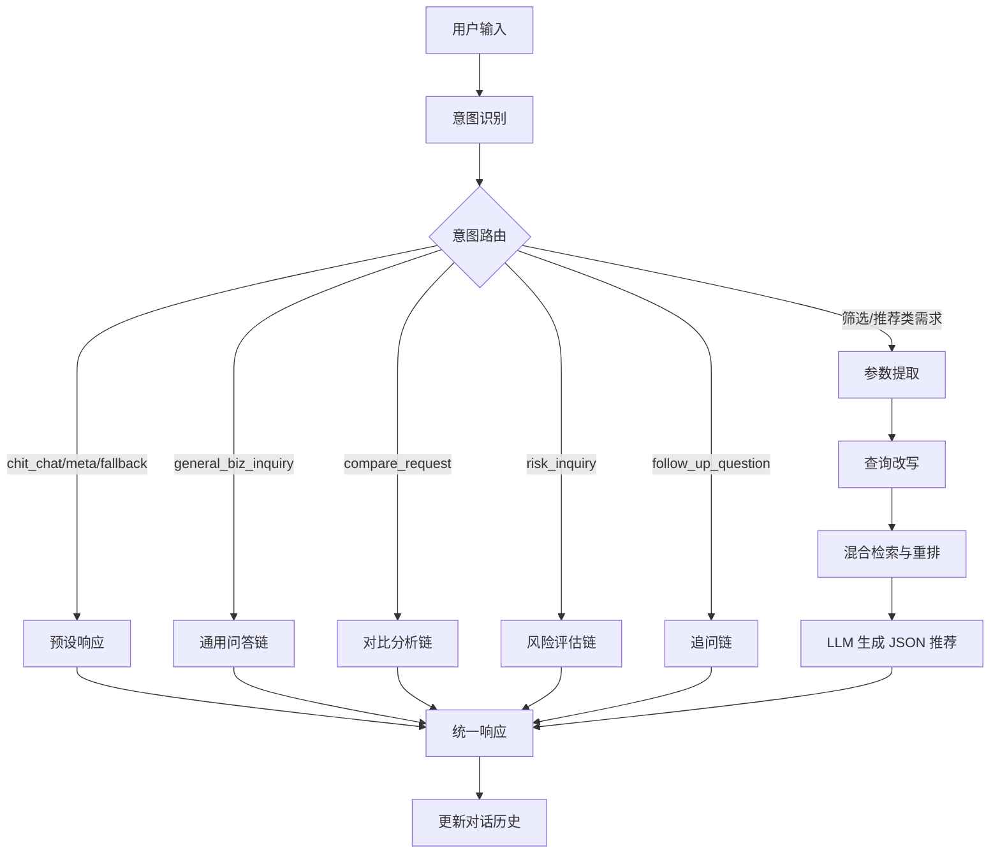
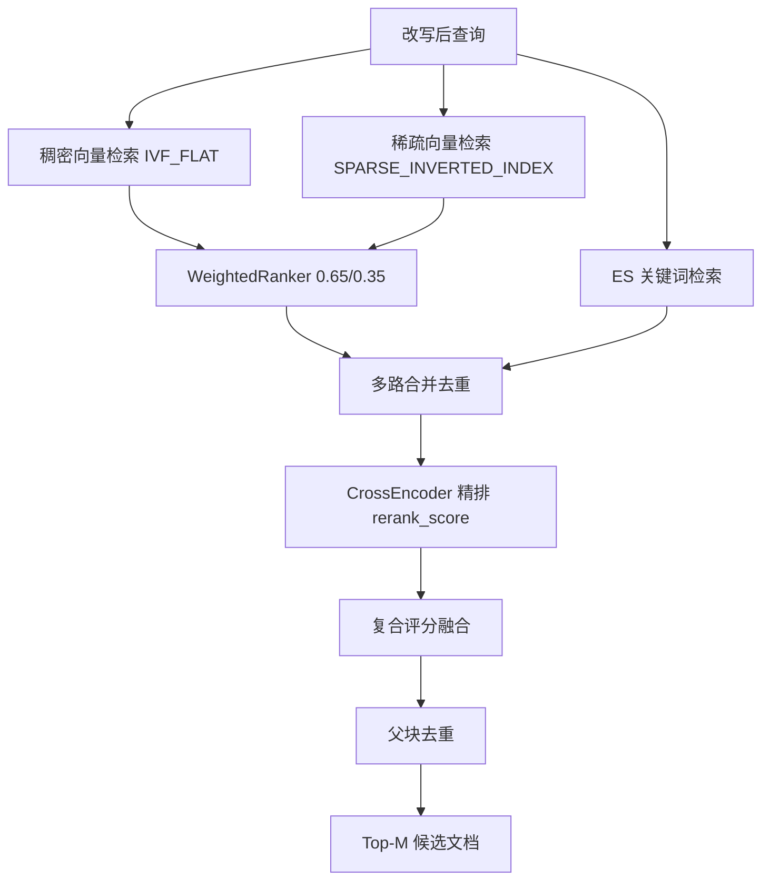

# 星海 · 智能供应商与产品选型推荐系统（SmartSelect）

> 基于 **RAG（检索增强生成）+ Agent 意图路由** 的供应链智能筛选推荐系统，面向 **供应商 / 产品 / 客户** 三大业务库，实现「自然语言提需求 → 结构化筛选 → 混合检索 → 智能推荐 → 对比 / 风险评估」的一站式闭环。

---

## 一、项目简介

在企业供应链与采购场景中，供应商资质、产品目录、客户档案往往以 **非结构化文档**（PDF / Word / Markdown / 图片）形式分散存储，传统关键词搜索 **召回率低、无法理解语义、缺乏业务价值排序**。

**星海（SmartSelect）** 通过以下能力解决上述痛点：

- **LLM 驱动的类型感知结构化抽取**：自动识别文档业务类型，抽取 20+ 结构化字段（评分、等级、认证、MOQ、风险等级等）。
- **三库混合检索**：Milvus 双向量（稠密 + 稀疏）+ Elasticsearch 关键词 + MongoDB 元数据，多路召回后融合。
- **CrossEncoder 精排 + 复合评分融合**：语义重排分、业务综合评分、风险惩罚因子三者加权，输出可解释的排序结果。
- **12 类意图路由 Agent**：区分筛选、追问、对比、风险、通用问答、闲聊等意图，分派至 6 条专用处理链。
- **多轮对话上下文管理**：支持基于上一轮结果的追问、修正、对比与风险评估。
- **现代化前端 + FastAPI 后端**：纯 HTML/CSS/JS 前端，内置 Mock 测试模块，可脱离后端独立演示 15 种交互场景。

### 核心特性一览

| 能力维度 | 说明 |
| --- | --- |
| 智能筛选推荐 | 输入自然语言需求，返回 Top-M 匹配的供应商 / 产品 / 客户卡片 |
| 多维评分体系 | 质量、价格、交期、信誉、规模 5 维度加权综合评分 |
| 风险提示 | 自动标注低 / 中 / 高风险，高风险项在推荐理由中明示 |
| 对比分析 | 勾选多个候选项，生成并排对比表格、优劣势与排名 |
| 多轮追问 | 基于上下文进行筛选型 / 问答型 / 风险型追问 |
| 文档入库 | 支持 md / pdf / docx / txt / ppt / 图片（OCR）多模态上传，MD5 去重 |

---

## 二、系统架构

### 2.1 整体分层架构



### 2.2 数据入库流程（离线 / 上传）



### 2.3 检索问答流程（在线）



### 2.4 混合检索与复合评分融合（核心）



---

## 三、技术亮点与创新点

### 亮点 1：Milvus 双向量混合检索（稠密 + 稀疏）

单一向量检索难以兼顾「语义泛化」与「术语精确」。本系统使用 **BGE-M3 一次编码同时输出稠密向量与稀疏向量**，在 Milvus 中并行存储：

| 向量类型 | 字段 | 索引 | 维度 | 擅长 |
| --- | --- | --- | --- | --- |
| 稠密向量 | `dense_vector` | `IVF_FLAT` (IP) | 1024 | 语义匹配、同义改写 |
| 稀疏向量 | `sparse_vector` | `SPARSE_INVERTED_INDEX` (IP) | 动态 | 关键词精确匹配、专业术语 |

两路 ANN 检索结果通过 `WeightedRanker(0.65, 0.35)` 融合，**既懂同义词、又不丢精确术语**。

### 亮点 2：三库协同的多路召回架构

- **Milvus**：向量语义召回（双向量）。
- **Elasticsearch**：BM25 关键词召回，支持 `doc_type` 结构化过滤。
- **MongoDB**：存储文档全文与结构化元数据，检索后回表补全字段并做父块去重。

三路结果合并去重后统一进入精排，显著提升召回覆盖率。

### 亮点 3：CrossEncoder 精排 + 复合评分融合公式

在召回结果上叠加 **CrossEncoder 精排**，并将语义相关性、业务价值、风险三要素融合为最终排序分：

```
final_score = (0.7 × rerank_score + 0.3 × normalized_overall) × risk_penalty
```

其中：
- `rerank_score`：CrossEncoder 输出的查询-文档语义相关性得分；
- `normalized_overall`：业务综合评分归一化到 [0,1]（缺失时默认 0.6）；
- `risk_penalty`：风险惩罚因子 —— 低=1.0、中=0.95、高=0.80。

**创新性**：将「检索相关性」与「业务价值 / 风险」解耦又融合，使推荐结果既语义相关、又符合采购业务理性。

### 亮点 4：LLM 驱动的类型感知结构化抽取

文档入库时先由 LLM 判定业务类型（supplier / product / customer / unknown），再套用 **对应的专用 Prompt** 抽取 20+ 字段。相比通用抽取，字段命中率和准确性更高，且为后续结构化过滤与评分奠定基础。

### 亮点 5：5 维度可配置综合评分模型

```
overall = Σ(dim_score × weight) / Σ(weight)
```

| 维度 | 权重 | 含义 |
| --- | --- | --- |
| quality | 0.25 | 质量评分 |
| price | 0.20 | 价格竞争力 |
| delivery | 0.20 | 交期 / 响应速度 |
| reputation | 0.20 | 信誉 / 资质 |
| scale | 0.15 | 规模 / 产能 |

权重在 `config.py` 中集中配置，可按行业灵活调整；缺失维度自动跳过并按剩余权重归一化，无有效评分时回退到等级映射分。

### 亮点 6：12 类意图路由 Agent + 6 条专用链

意图分类覆盖：`supplier_request`、`product_request`、`customer_request`、`general_request`、`refinement_or_correction`、`follow_up_question`、`compare_request`、`risk_inquiry`、`general_biz_inquiry`、`chit_chat`、`meta_inquiry`、`fallback`。

不同意图分派至：**预设响应 / 通用问答链 / 对比分析链 / 风险评估链 / 追问链 / RAG 主链**，实现精准的任务分流。

### 亮点 7：父子分块（Parent-Child Chunking）

- **子块（500 字）** 用于向量化与精确检索；
- **父块（1200 字）** 保留完整上下文，命中后回表返回父块内容给 LLM，兼顾「检索精度」与「上下文完整性」；
- Markdown 文档使用 `MarkdownTextSplitter` 按结构切分，其他文档使用 `RecursiveCharacterTextSplitter`。

### 亮点 8：查询改写 + 多轮上下文消解

RAG 主链在检索前先由 LLM 结合对话历史 **改写查询**，补全「上一家」「这个产品」等指代，使多轮对话中的检索依然精准。

### 亮点 9：全异步 RAG 链

基于 LangChain `RunnablePassthrough` + `ainvoke`，检索、重排（`asyncio.to_thread` 包裹同步 CrossEncoder）、生成全链路异步，配合 FastAPI 支持高并发会话。

### 亮点 10：前端 Mock 测试模块

`frontend/mock_backend.js` 通过拦截 `fetch`，在 **无需后端 / 数据库 / LLM** 的情况下模拟 15 种用户输入场景（含空结果、后端报错、无上下文对比等边界情况），极大方便前端联调与演示。

---

## 四、技术栈

| 层次 | 技术选型 |
| --- | --- |
| 大语言模型 | Qwen（`qwen3.7-plus`，DashScope OpenAI 兼容接口） |
| Embedding / Reranker | BGE-M3（1024 维稠密 + 稀疏向量，CrossEncoder 精排，本地部署） |
| 向量数据库 | Milvus v2.4.4（IVF_FLAT + SPARSE_INVERTED_INDEX） |
| 全文检索 | Elasticsearch（BM25 关键词召回） |
| 元数据 / 全文存储 | MongoDB |
| 对象存储 / 协调 | MinIO + etcd（Milvus 依赖） |
| RAG 框架 | LangChain（RunnablePassthrough、ChatPromptTemplate、StrOutputParser） |
| 后端 | FastAPI + Uvicorn（异步会话管理） |
| 前端 | 原生 HTML / CSS / JavaScript（渐变卡片、动画评分条、毛玻璃弹窗） |
| 文档解析 | unstructured、PyPDF2、python-docx、docx2txt、图片 OCR（LLM 视觉） |
| 评估框架 | Ragas（faithfulness / answer_relevancy / context_precision / context_recall） |
| 日志 | Loguru（按大小轮转） |
| 容器化 | Docker Compose |
| 运行环境 | Python 3.10 |

---

## 五、项目结构

```
Intelligent_Supplier_and_Product_Selection_Recommendation_System/
├── config.py                  # 全局配置（数据库/模型/评分权重/风险阈值）
├── system_data_init.py        # 批量数据初始化入库脚本
├── api_server.py              # FastAPI 后端服务（替代 Streamlit）
├── app.py                     # Streamlit 旧版前端（保留）
├── docker-compose.yaml        # Milvus/etcd/MinIO 容器编排
├── data/                      # 业务文档数据
│   ├── suppliers/             # 供应商资料
│   ├── products/              # 产品目录
│   └── customers/             # 客户档案
├── rag/
│   ├── chain.py               # 异步 RAG 链（查询改写 + 检索 + 生成）
│   └── rag_pipeline.py        # 意图路由 Agent（12类意图 + 6条专用链）
├── utils/
│   ├── document_processor.py  # 多模态解析 + 结构化抽取 + 父子分块
│   └── vector_store.py        # 三库混合检索 + 重排 + 复合评分融合
├── eval/
│   └── evaluator.py           # Ragas 模型评估
├── frontend/
│   ├── index.html             # 前端页面结构
│   ├── styles.css             # 样式（渐变/玻璃拟态/评分动画）
│   ├── app.js                 # 交互逻辑
│   └── mock_backend.js        # Mock 测试模块（15种场景）
├── models/                    # 本地模型存放目录（BGE-M3）
├── logs/                      # 运行日志
└── temp/                      # 上传临时文件
```

---

## 六、快速开始

### 6.1 环境准备

- Python 3.10+
- Docker & Docker Compose
- 本地模型：将 **BGE-M3** 模型放置于 `config.MODEL_PATH`（默认 `D:/models/embedding/bge-m3`）
- DashScope API Key（用于 Qwen LLM）

### 6.2 启动基础服务

`docker-compose.yaml` 默认启用 `etcd`、`minio`、`milvus`。**MongoDB 与 Elasticsearch 在文件中以注释形式提供**，如需使用请取消对应服务注释后再启动：

```bash
docker-compose up -d
```

服务端口：

| 服务 | 端口 |
| --- | --- |
| Milvus | 19530（gRPC）/ 9091（指标） |
| MinIO | 9001 → 9000 |
| MongoDB | 27017 |
| Elasticsearch | 9200 / 9300 |
| etcd | 2379 |

> 依赖顺序：`milvus` 依赖 `etcd` 与 `minio`，Compose 已配置 `depends_on`。

### 6.3 配置

编辑 `config.py`，重点确认：

- `DASHSCOPE_API_KEY`：LLM 密钥
- `MODEL_PATH` / `EMBEDDING_MODEL`：本地 BGE-M3 路径
- 各数据库 `HOST` / `PORT` / 账号密码
- `SCORE_WEIGHTS`、`RISK_THRESHOLD`：评分与风险策略

### 6.4 数据初始化入库

将业务文档放入 `data/suppliers`、`data/products`、`data/customers`，执行：

```bash
python system_data_init.py
```

脚本会自动完成：加载 → 类型识别 → 结构化抽取 → 评分 → 分块 → 双向量编码 → 三库入库，并输出成功 / 跳过 / 失败统计。

### 6.5 启动后端服务

```bash
python api_server.py
# 或
uvicorn api_server:app --host 0.0.0.0 --port 8000
```

启动后访问 `http://localhost:8000` 即可打开前端页面（FastAPI 已托管 `frontend/` 静态资源）。

### 6.6 前端 Mock 演示（无需后端）

直接用浏览器打开 `frontend/index.html`，点击右下角「🧪 模拟测试」悬浮按钮，可单击单个场景或「按顺序全部执行」，体验 15 种交互效果；取消勾选「Mock 模式」即恢复连接真实后端。

---

## 七、API 文档

| 方法 | 路径 | 说明 |
| --- | --- | --- |
| GET | `/api/health` | 健康检查 |
| GET | `/api/config` | 前端默认配置（文档类型、推荐数量、风险阈值） |
| POST | `/api/chat` | 主对话入口：筛选 / 追问 / 对比 / 风险 / 通用问答 |
| POST | `/api/compare` | 对勾选候选项生成并排对比分析 |
| GET | `/api/document/{doc_hash}` | 文档详情：结构化数据 + 全文 |
| POST | `/api/upload` | 文档上传与入库（多模态） |

### 请求示例：`POST /api/chat`

```json
{
  "session_id": "default",
  "prompt": "推荐3家深圳地区A级电子元件供应商，综合评分80以上，MOQ不超过1000",
  "last_results": null,
  "filters": { "doc_type": "supplier", "location": "深圳" }
}
```

### 响应示例

```json
{
  "session_id": "default",
  "response": "根据您的需求，为您推荐以下供应商：",
  "results": [
    {
      "name": "华星电子科技",
      "doc_type": "supplier",
      "reason": "ISO9001/IATF16949 认证齐全，综合评分 90，交期履约率 98%。",
      "overall_score": 90,
      "grade": "A",
      "industry": "电子制造",
      "location": "深圳",
      "risk_level": "低",
      "doc_hash": "..."
    }
  ],
  "ui_extra": null
}
```

> `ui_extra` 在对比场景返回 `mode=compare`（含对比表格、优劣势、排名），在风险场景返回 `mode=risk`（含风险明细）。

---

## 八、模型评估

系统内置基于 **Ragas** 的 RAG 质量评估（`eval/evaluator.py`），覆盖 4 大核心指标：

- **Faithfulness（忠实度）**：答案是否严格基于检索上下文，衡量幻觉程度。
- **Answer Relevancy（答案相关性）**：答案与用户问题的语义相关程度。
- **Context Precision（上下文精度）**：检索上下文中相关内容的排序质量。
- **Context Recall（上下文召回）**：检索上下文对标准答案的覆盖程度。

评估分两部分：**评估流程健全性检查**（姚明测试用例，期望 Faithfulness=1.0）与 **端到端真实场景评估**（供应商筛选）。

运行评估：

```bash
python -m eval.evaluator
```

> 完整评估体系设计、指标定义、功能性测试覆盖矩阵与评估报告，详见 [模型评估报告](./EVALUATION_REPORT.md)。

---

## 九、内置功能验证

除 Ragas 质量评估外，各核心模块均带有独立验证入口：

```bash
python utils/document_processor.py   # 文档加载/解析/评分/分块验证
python utils/vector_store.py         # 混合检索与重排验证
python rag/chain.py                  # 异步 RAG 链验证
python rag/rag_pipeline.py           # 意图路由 T1-T7 场景验证
```

---

## 十、常见问题

**Q：启动报错连接不上 Milvus / ES / MongoDB？**
A：确认 `docker-compose up -d` 已启动相应服务；注意 `docker-compose.yaml` 中 MongoDB 与 Elasticsearch 默认被注释，需手动取消注释或使用外部实例，并核对 `config.py` 中的连接配置。

**Q：BGE-M3 模型加载失败？**
A：确认 `config.MODEL_PATH` 指向正确的本地模型目录，且目录内含完整模型文件；系统默认 `HF_HUB_OFFLINE=1` 离线加载。

**Q：上传文档提示「已存在」？**
A：系统基于文件 MD5 哈希去重，重复文档会自动跳过入库。
